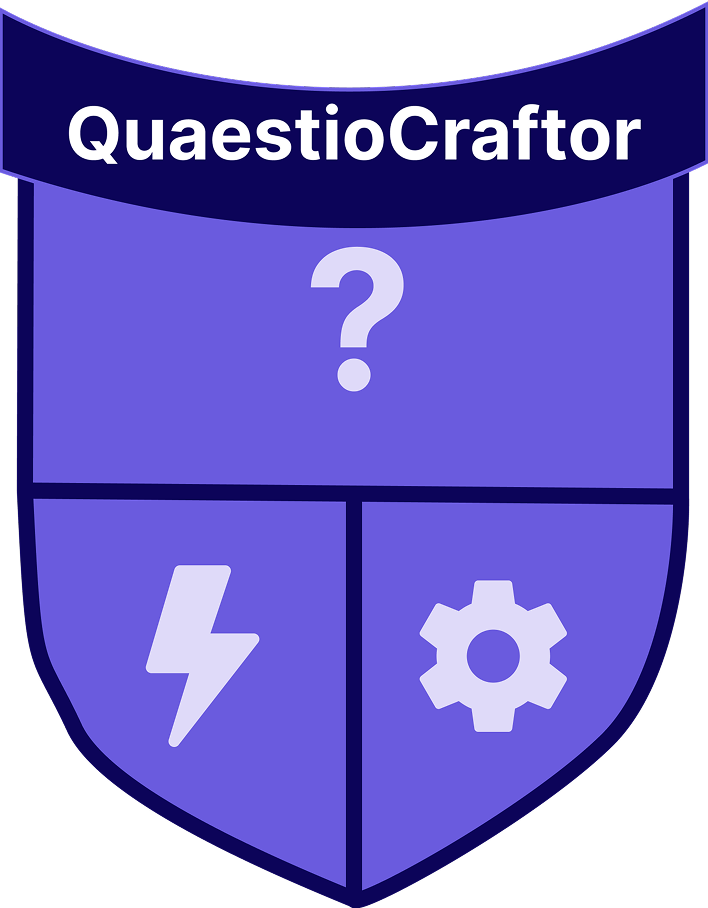

<h3 align="center">QuaestioCraftor</h3>
<h5 align="center">AI-Powered Quiz Creation & Learning Experience</h5>
</br>
<p align="center">
  <a href="https://github.com/Sean-D-231121/QuaestioCraftor-react-native-app">
    
  </a>
  <br />
  <br />
  <a href="https://drive.google.com/file/d/1017hbdeWoZ5rdLEOmnYTlhEoMtSovfdC/view?usp=sharing">View Demo</a>
  ·
  <a href="https://github.com/Sean-D-231121/QuaestioCraftor-react-native-app/issues">Report Bug</a>
  ·
  <a href="https://github.com/Sean-D-231121/QuaestioCraftor-react-native-app/issues">Request Feature</a>
</p>

---

## Table of Contents

* [About the Project](#about-the-project)
  * [Project Description](#project-description)
  * [Built With](#built-with)
* [Getting Started](#getting-started)
  * [Prerequisites](#prerequisites)
  * [How to Install](#how-to-install)
* [Features and Functionality](#features-and-functionality)
* [Concept Process](#concept-process)
  * [Ideation](#ideation)
  * [Project Pitch Document](#project-pitch-document)
  * [Wireframes](#wireframes)
  * [Schema Visualisation](#schema-visualisation)
* [Development Process](#development-process)
  * [Implementation Process](#implementation-process)
    * [Highlights](#highlights)
    * [Challenges](#challenges)
* [User Testing and Insights](#user-testing-and-insights)
   * [Question examples and answers](#question-examples-and-answers)
   * * [Insights](#insights)
  * [Future Implementation](#future-implementation)
* [Final Outcome](#final-outcome)
  * [Mockups](#mockups)
  * [Video Demonstration](#video-demonstration)
* [Conclusion](#conclusion)
* [License](#license)
* [Contact](#contact)
* [Acknowledgements](#acknowledgements)

---

## About the Project

### Project Description

**QuaestioCraftor** is an **AI-driven React Native quiz application** designed to help users learn through smart, dynamically generated quizzes.  
Using AI prompt responses, users can create unique quiz sets, track their progress, and enhance knowledge retention across topics.  

Built with **React Native** and **Supabase** for backend storage and authentication, QuaestioCraftor integrates modern UI/UX practices from **React Native Paper**, and **Expo** for a seamless learning experience.  

---

### Built With

- **Frontend / Mobile**
  - [React Native](https://reactnative.dev/)
  - [Expo](https://expo.dev/)
  - [React Navigation](https://reactnavigation.org/)
  - [React Native Paper](https://callstack.github.io/react-native-paper/)
  - [TypeScript](https://www.typescriptlang.org/)

- **Backend / Database**
  - [Supabase](https://supabase.io/)
  - [OpenAI API / AI Service Integration](https://platform.openai.com/)
  - [PostgreSQL](https://www.postgresql.org/)

- **UI / Styling**
  - [React Native Gesture Handler](https://docs.swmansion.com/react-native-gesture-handler/)
  - [React Native Reanimated](https://docs.swmansion.com/react-native-reanimated/)
  - [Expo Vector Icons](https://icons.expo.fyi/)
  - [React Native Paper Components](https://callstack.github.io/react-native-paper/)

---

## Getting Started

### Prerequisites

- **Node.js** (v16+)
- **Expo CLI** installed globally:
```sh
npm install -g expo-cli
```
### How To install

1. Clone Repository:
```sh
git clone https://github.com/Sean-D-231121/QuaestioCraftor-react-native-app.git
```
2. Navigate into the folder:
```sh
cd QuaestioCraftor-react-native-app
```
3. Install dependencies:
```sh
npm install
```
4. Set up Supabase and Environment Variables:
Create a .env file in the root directory:
```sh
SUPABASE_URL=your_supabase_url
SUPABASE_ANON_KEY=your_supabase_anon_key
```
5. Query Database in supabase:
```sh
CREATE TABLE public.users (
  id uuid NOT NULL DEFAULT gen_random_uuid(),
  username text NOT NULL,
  email text NOT NULL UNIQUE,
  points integer DEFAULT 0,
  created_at timestamp with time zone DEFAULT now(),
  avatar_url text,
  auth_id uuid,
  CONSTRAINT users_pkey PRIMARY KEY (id)
);

CREATE TABLE public.quizzes (
  quizid uuid NOT NULL DEFAULT gen_random_uuid(),
  user_id uuid,
  topic text NOT NULL,
  quiz_type text NOT NULL,
  difficulty text NOT NULL,
  question_count integer NOT NULL,
  created_at timestamp with time zone DEFAULT now(),
  CONSTRAINT quizzes_pkey PRIMARY KEY (quizid),
  CONSTRAINT quizzes_user_id_fkey FOREIGN KEY (user_id) REFERENCES public.users(id) ON DELETE SET NULL
);

CREATE TABLE public.questions (
  question_id uuid NOT NULL DEFAULT gen_random_uuid(),
  quiz_id uuid,
  question_text text NOT NULL,
  answer text NOT NULL,
  type text NOT NULL,
  options jsonb,
  CONSTRAINT questions_pkey PRIMARY KEY (question_id),
  CONSTRAINT questions_quiz_id_fkey FOREIGN KEY (quiz_id) REFERENCES public.quizzes(quizid) ON DELETE CASCADE
);

CREATE TABLE public.quiz_attempts (
  attempt_id uuid NOT NULL DEFAULT gen_random_uuid(),
  user_id uuid,
  quiz_id uuid,
  score integer,
  total integer,
  created_at timestamp with time zone DEFAULT now(),
  CONSTRAINT quiz_attempts_pkey PRIMARY KEY (attempt_id),
  CONSTRAINT quiz_attempts_quiz_id_fkey FOREIGN KEY (quiz_id) REFERENCES public.quizzes(quizid) ON DELETE CASCADE,
  CONSTRAINT quiz_attempts_user_id_fkey FOREIGN KEY (user_id) REFERENCES public.users(id) ON DELETE CASCADE
);

CREATE TABLE public.submitted_answers (
  id uuid NOT NULL DEFAULT gen_random_uuid(),
  attempt_id uuid,
  question_id uuid,
  selected_answer text,
  correct_answer text,
  is_correct boolean,
  CONSTRAINT submitted_answers_pkey PRIMARY KEY (id),
  CONSTRAINT submitted_answers_question_id_fkey FOREIGN KEY (question_id) REFERENCES public.questions(question_id) ON DELETE CASCADE,
  CONSTRAINT submitted_answers_attempt_id_fkey FOREIGN KEY (attempt_id) REFERENCES public.quiz_attempts(attempt_id) ON DELETE CASCADE
);

```
6. Clone backend repository/ [Go to Backend](https://github.com/Sean-D-231121/QuaestioCraftor-backend)
```sh
https://github.com/Sean-D-231121/QuaestioCraftor-backend.git
```
7. Create a virtual environment
```sh
python -m venv .venv
```
8. Activate it:
```sh
.venv\Scripts\activate
```
9. Create .env in QuaestiCraftor Backend and setup OpenAI API 
```sh
OPENAI_API_KEY=YOUR_API_KEY
```

11. Install dependencies:
```sh
pip install --upgrade pip
pip install -r requirements.txt
```

12. Start Backend app
```sh
uvicorn main:app --reload
```
13. Run the app:
```sh
npx expo start
```
Alternatively
```sh
npm start
```

## Features and Functionality

### SplashScreen

- Displays app logo while app resources load.

<p align="center">
 
</p>

### Sign-up/Sign-in

- Add user avatar for images.
- Basic Sign-in and Sign up for users with supabase authentication.

<p align="center">
 
  
</p>

### Quiz Generation

- Create quizzes powered by AI-generated topics and questions.
- Choose difficulty levels and topics dynamically.
  
<p align="center">
 
</p>
### Profile

- View past quizzes with scores, topics, and timestamps.
- View user information

<p align="center">
 
</p>

### Leaderboards

- See where you rank on leaderboard through filters like today, weekly and all time

<p align="center">
 
</p>

### QuizPlayer

- Get choices between MCQ(Multiple choice questions) and True/False questions
- Displays total correct answers and also which questions were right and wrong.

<p align="center">
 
   
</p>

### HomeScreeen

- Shortcut for create quiz and leaderboard
- Play and fetch new recent quizzes
  
<p align="center">
 
</p>
   
## Concept Process

### Ideation

The idea came to me through searching the internet and I wanted to create something which could allow anyone to quickly make a quiz and gain basic information about any topic on the internet so I thought up QuaestioCraftor which means "Question" and "Craft" from latin. I wanted to create a casual feel making it comfortable for users to casually learn about stuff at anytime without being competitive.

### Core ideas:

- Personalized quizzes from natural language prompts.

- Real-time feedback and tracking.

- A gamified leaderboard for motivation.

### Project Pitch Document
[Project Pitch](https://github.com/Sean-D-231121/QuaestioCraftor-react-native-app/assets/Final-planning-pitch.pdf)

### Wireframes

<p align="center">    </p>

### Schema Visualisation

<p align="center"> </p>


## Development Process

### Implementation Process

***Frontend (React Native + Expo)***

- Developed modular screens using React Navigation.

- Implemented animations with Reanimated.

- Integrated Supabase auth and API services.

- Styled components with React Native Paper.
  

***Backend (Supabase + AI Integration)***

- Connected Supabase for real-time data and auth.

- Integrated AI prompt processing for dynamic quiz generation.

- Used Supabase Postgres for storing user progress and quiz history.


## Highlights

- Connecting and exploring supabase as a database alternative and its security options.
- Creating the leaderboard and getting information from quizattempts table.
- Deploying and connecting python Open AI API backend to Render that connects to frontend with json output.

## Challenges

- UI and styling for react-native-paper
- Leaderboard data organisation
- Stats calculations and implemention
- Quiz API connection and quizPlayer implementation
- Supabase permissions and Image storage

## User Testing and Insights

### Question examples and answers

<p align="center">      </p>

### Insights

- People are confused about what MCQ is and the touchpoints for difficulty and quiz type are left out.
- Not many errors besides waiting for AI backend to create quiz.
- Sign up had no problems occur when loading besides lacking KeyboarAvoidView component.
- I need to focus on expanding quiz functionality and editing.
- Perhaps need to deploy backend some place other than Render.com


## Future Implementation

- Adaptive quizzes that change difficulty based on performance.
- Flashcard learning mode.
- Multilingual support (English, Afrikaans, Zulu, etc.).
- Export quizzes as PDF for offline use.
- Teacher-specific mode for classroom sharing.
- AI quiz generation from text/document/URL.
  
## Final Outcome
### Mockups
<p align="center">
  <br><br>
  <br><br>
  <br><br>
  <br><br>
  
</p>

### Video Demonstration 

[View Demo](https://drive.google.com/file/d/1017hbdeWoZ5rdLEOmnYTlhEoMtSovfdC/view?usp=sharing)

## Conclusion

## License
Distributed under the MIT License. See LICENSE for more information

## Contact

**Sean Dubbelman**  
Email: [231121@virtualwindow.co.za](mailto:231121@virtualwindow.co.za)  
GitHub: [@Sean](https://github.com/Sean-D-231121)

## Acknowledgements
- [Armand Pretorious]()
- Supabase docs
- React Native Paper docs
- Expo
- OpenAI API docs
- Chatgpt/Open AI LLM
- YouTube for tutorials and guidance
- Unsplash for user Images
- User Testers
- Render.com
